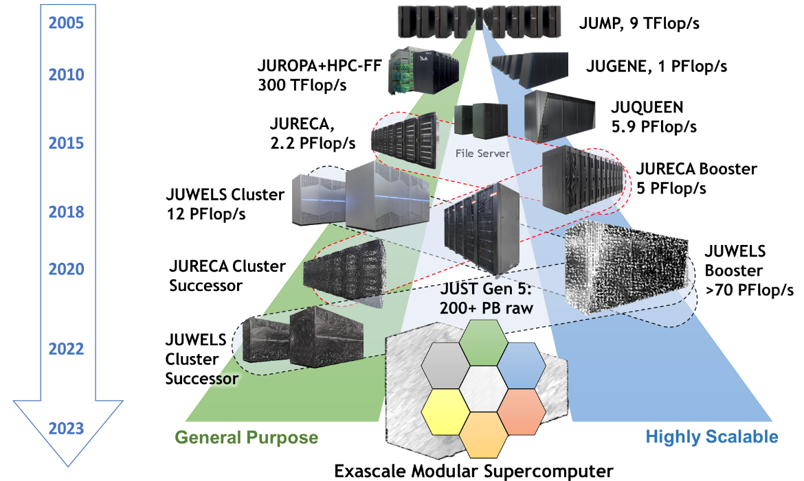
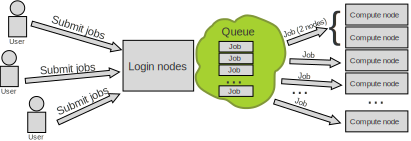
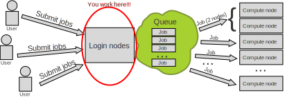
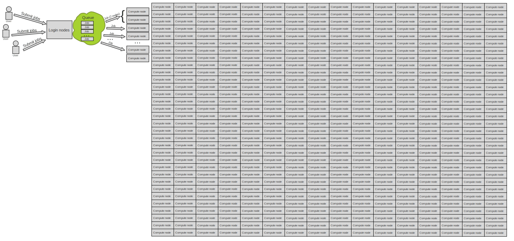
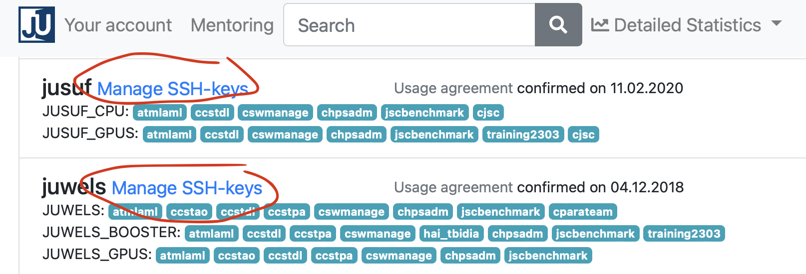
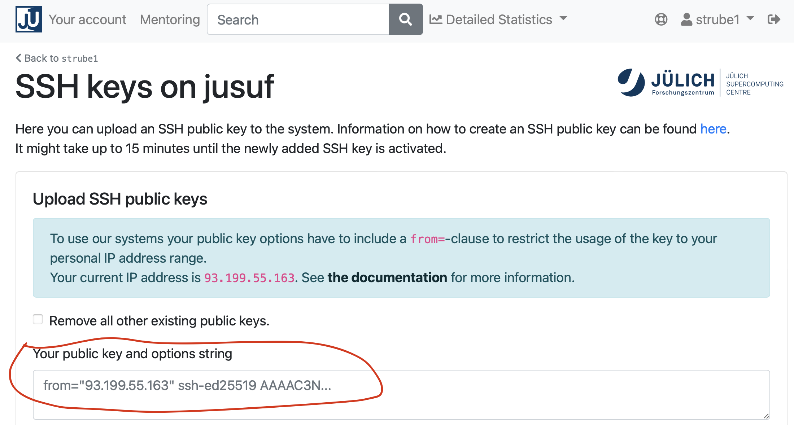
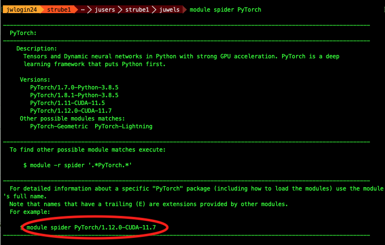
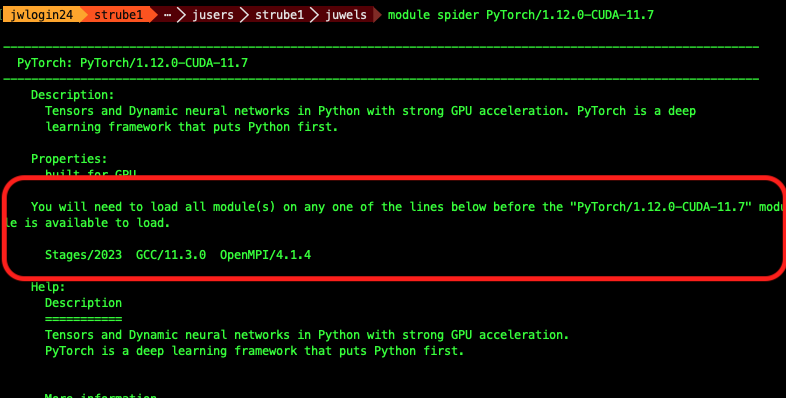

## Communication:

Links for the complimentary parts of this course: 

- [Zoom](https://go.fzj.de/intro-sc-ai-2023-zoom)
- [Slack](https://go.fzj.de/intro-sc-ai-2023-slack)
- [JSC Training Page](https://go.fzj.de/intro-sc-ai-2023-course)
- [Judoor project page invite](https://go.fzj.de/intro-sc-ai-2023-project-join)
- [This document: http://go.fzj.de/intro-sc-ai-2023](http://go.fzj.de/intro-sc-ai-2023)
- Our mailing list for [AI news](https://lists.fz-juelich.de/mailman/listinfo/ml)
- [Survey at the end of the course](https://go.fzj.de/intro-sc-ai-2023-survey)
- [Virtual Environment template](https://gitlab.jsc.fz-juelich.de/kesselheim1/sc_venv_template)
- [SOURCE CODE OF THE WHOLE COURSE on Github - Including presentations](https://go.fzj.de/intro-sc-ai-2023-repo)


---

## Goals for this course:

- Make sure you know how to access and use our machines 👩‍💻
- Put your data in way that supercomputer can use it fast 💨
- Distribute your ML workload 💪
- Important: This is _*NOT*_ a basic AI course 🙇‍♂️
  - If you need one, check [fast.ai](https://course.fast.ai)


---

## Team:

::: {.container}
:::: {.col}

::::
:::: {.col}

::::
:::


---

### Schedule for day 1

| Time          | Title        |
| ------------- | -----------  |
| 09:00 - 09:15 | Welcome      |
| 09:15 - 10:00 | Introduction |
| 10:00 - 10:15 | Coffee break |
| 10:00 - 10:30 | Judoor, Keys |
| 10:30 - 11:00 | SSH, Jupyter, VS Code |
| 11:00 - 11:15 | Coffee Break |
| 11:15 - 12:00 | Running services on the login and compute nodes | 
| 12:00 - 12:15 | Coffee Break |
| 12:30 - 13:00 | Sync (everyone should be at the same point) |

---

### Note

Please open this document on your own browser! We will need it for the exercises.
[http://go.fzj.de/intro-sc-ai-2023](http://go.fzj.de/intro-sc-ai-2023)


---

### Jülich Supercomputers



---

### What is a supercomputer?

- Compute cluster: Many computers bound together locally 
- Supercomputer: A damn lot of computers bound together locally😒
  - with a fancy network 🤯

---

### Anatomy of a supercomputer

-  Login Nodes: Normal machines, for compilation, data transfer,  scripting, etc. No GPUs.
- Compute Nodes: Guess what? 
  - For compute! With GPUs! 🤩
- High-speed, ultra-low-latency network
- Shared networked file systems
- Some numbers we should (more or less) know about them:
    - Nodes
    - Cores, Single-core Performance
    - RAM
    - Network: Bandwidth, Latency
    - Accelerators (e.g. GPUs)

---

### JUWELS Booster Compute Nodes

- 936 Nodes
- 2x AMD EPYC Rome 7402 CPU 2.7 GHz (48 cores x 2 threads = 96 virtual cores/node)
- 512 GiB memory
- Network Mellanox HDR infiniband (FAST💨 and EXPENSIVE💸)
- 4x NVIDIA A100 with 40gb 😻
- TL;DR: 89856 cores, 3744 GPUs, 468 TB RAM 💪
- Way deeper technical info at [Juwels Booster Overview](https://apps.fz-juelich.de/jsc/hps/juwels/booster-overview.html)

---

## How do I use a Supercomputer?

- Batch: For heavy compute, ML training
- Interactively: Jupyter

---

### You don't use the whole supercomputer

#### You submit jobs to a queue asking for resources



---

### You don't use the whole supercomputer

#### And get results back



---

### You don't use the whole supercomputer

#### You are just submitting jobs via the login node


---

### You don't use the whole supercomputer

#### You are just submitting jobs via the login node



---

### You don't use the whole supercomputer

#### You are just submitting jobs via the login node


---

### You don't use the whole supercomputer


::: {.container}
:::: {.col}
- Your job(s) enter the queue, and wait for its turn
- When there are enough resources for that job, it runs
::::
:::: {.col}

::::
:::


---

### You don't use the whole supercomputer

#### And get results back


---

### Supercomputer Usage Model
- Using the the supercomputer means submitting a job to a batch system.
- No node-sharing. The smallest allocation for jobs is one compute node (4 GPUs).
- Maximum runtime of a job: 24h.

---

### Recap:

- Login nodes are for submitting jobs, move files, compile, etc
- NOT FOR TRAINING NEURAL NETS

---

### Recap:

- User submit jobs
- Job enters the queue
- When it can, it runs
- Sends results back to user

---

### Connecting to JUWELS BOOSTER

#### Getting compute time
- Go to [https://go.fzj.de/intro-sc-ai-2023-project-join](https://go.fzj.de/intro-sc-ai-2023-project-join)
- Join the course project `training2324`
- Sign the Usage Agreements ([Video](https://drive.google.com/file/d/1mEN1GmWyGFp75uMIi4d6Tpek2NC_X8eY/view))
- Compute time allocation is based on compute projects. For every compute job, a compute project pays.
- Time is measured in core-hours. One hour of Juwels BOOSTER is 48 core-hours.
- Example: Job runs for 8 hours on 64 nodes of Juwels BOOSTER: 8 * 64 * 48 = 24576 core-h!

---

## Jupyter

[jupyter-jsc.fz-juelich.de](https://jupyter-jsc.fz-juelich.de)

- Jupyter-JSC uses the queue 
- When you are working on it, you are using project time ⌛️
- *Yes, if you are just thinking and looking at the 📺, you are burning project time*🤦‍♂️
- It's useful for small tests - not for full-fledged development 🙄

---

## Jupyter

#### Pay attention to the partition - DON'T RUN IT ON THE LOGIN NODE!!!


---

## Connecting to JUWELS BOOSTER

---

## VSCode

- [Download VScode: code.visualstudio.com](https://code.visualstudio.com/download)
- Install and run it
  - On the local terminal, type `code`
- Install [Remote Development Tools](https://marketplace.visualstudio.com/items?itemName=ms-vscode-remote.vscode-remote-extensionpack)
- Install [Remote: SSH](https://marketplace.visualstudio.com/items?itemName=ms-vscode-remote.remote-ssh)
- If you have Windows, you need WSL as explained on the email.

---

## VSCode

### Now with the remote explorer tab


---

#### SSH
- SSH is a secure shell (terminal) connection to another computer
- You connect from your computer to the LOGIN NODE
- Security is given by public/private keys
- A connection to the supercomputer needs a 
    1. Key,
    2. Configuration
    3. Key/IP address known to the supercomputer

---

### SSH

#### Create key in VSCode's Terminal (menu View->Terminal)

```bash
mkdir ~/.ssh/
ssh-keygen -a 100 -t ed25519 -f ~/.ssh/id_ed25519-JSC
```

```bash
$ ssh-keygen -a 100 -t ed25519 -f ~/.ssh/id_ed25519-JSC
Generating public/private ed25519 key pair.
Enter passphrase (empty for no passphrase): 
Enter same passphrase again: 
Your identification has been saved in /Users/strube1/.ssh/id_ed25519-JSC
Your public key has been saved in /Users/strube1/.ssh/id_ed25519-JSC.pub
The key fingerprint is:
SHA256:EGNNC1NTaN8fHwpfuZRPa50qXHmGcQjxp0JuU0ZA86U strube1@Strube-16
The keys randomart image is:
+--[ED25519 256]--+
|      *++oo=o. . |
|     . =+o .= o  |
|      .... o.E..o|
|       .  +.+o+B.|
|        S  =o.o+B|
|          . o*.B+|
|          . . =  |
|           o .   |
|            .    |
+----[SHA256]-----+
```

---

### SSH

#### Configure SSH session

```bash
code $HOME/.ssh/config
```

---

### SSH

#### Configure SSH session

```bash
Host booster
        HostName juwels-booster.fz-juelich.de
        User [MY_USERNAME]   # Here goes your username, not the word MY_USERNAME.
        AddressFamily inet
        IdentityFile ~/.ssh/id_ed25519-JSC
```

Copy contents to the config file and save it 

**REPLACE [MY_USERNAME] WITH YOUR USERNAME!!! 🤦‍♂️**

---

### SSH

####  JSC restricts from where you can login
#### So we need to:
1. Find our ip range
2. Add the range and key to [Judoor](https://judoor.fz-juelich.de)

---

### SSH

#### Find your ip/name range

Open **[https://www.whatismyip.com](https://www.whatismyip.com)**

---

### SSH

#### Find your ip/name range


- Let's keep this inside vscode: `code key.txt` and paste the number you got

---

### SSH

Did everyone get their **own** ip address?

---

### SSH - EXAMPLE

- I will use the number `93.199.55.163`
- **YOUR NUMBER IS DIFFERENT**
- Seriously

---

### SSH - Example: `93.199.55.163`

- Go to VSCode and make it simpler, replace the 2nd half with `"0.0/16"`:
  - It was `93.199.55.163`
  - Becomes `93.199.0.0/16` (with YOUR number, not with the example)
- Add a `from=""` around it
- So, it looks like this, now: `from="93.199.0.0/16"`
- Add a second magic number, with a comma: `,10.0.0.0/8` 🧙‍♀️
- I promise, the magic is worth it 🧝‍♂️ (If time allows)
- In the end it looks like this: `from="93.199.0.0/16,10.0.0.0/8"` 🎬
- Keep it open, we will use it later

---

### SSH - Example: `93.199.0.0/16`

#### Copy your ssh key
- Terminal: `code ~/.ssh/id_ed25519-JSC.pub`
- Something like this will open:

- ```bash
ssh-ed25519 AAAAC3NzaC1lZDE1NTA4AAAAIHaoOJF3gqXd7CV6wncoob0DL2OJNfvjgnHLKEniHV6F strube@demonstration.fz-juelich.de
```

- Paste this line at the same `key.txt` which you just opened

---

### SSH

#### Example: `93.199.0.0/16`

- Put them together and copy again:
- ```bash
from="93.199.0.0/16,10.0.0.0/8" ssh-ed25519 AAAAC3NzaC1lZDE1NTA4AAAAIHaoOJF3gqXd7CV6wncoob0DL2OJNfvjgnHLKEniHV6F strube@demonstration.fz-juelich.de
```

---

### SSH

- Let's add it on [Judoor](https://judoor.fz-juelich.de)
- 
- Do it for JUWELS and JUDAC with the same key

---

### SSH

#### Add new key to [Judoor](https://judoor.fz-juelich.de)

{ width=850px }

This might take some minutes

---

### SSH: Exercise

That's it! Give it a try (and answer yes)

```bash
$ ssh booster
The authenticity of host 'juwels22.fz-juelich.de (134.94.0.185)' cannot be established.
ED25519 key fingerprint is SHA256:ASeu9MJbkFx3kL1FWrysz6+paaznGenChgEkUW8nRQU.
This key is not known by any other names
Are you sure you want to continue connecting (yes/no/[fingerprint])? Yes
**************************************************************************
*                            Welcome to JUWELS BOOSTER                   *
**************************************************************************
...
...
strube1@juwels22~ $ 
```

---

### SSH: Exercise 
#### Make sure you are connected to the supercomputer

```bash
# Create a shortcut for the project on the home folder
ln -s $PROJECT_training2324 ~/course

# Create a folder for myself
mkdir course/$USER

# Enter course folder and
cd ~/course/$USER

# Where am I?
pwd

# We well need those later
mkdir ~/course/$USER/.cache
mkdir ~/course/$USER/.config
mkdir ~/course/$USER/.fastai

ln -s ~/course/$USER/.cache $HOME/
ln -s ~/course/$USER/.config $HOME/
ln -s ~/course/$USER/.fastai $HOME/
```

---

## Working with the supercomputer's software

- We have literally thousands of software packages, hand-compiled for the specifics of the supercomputer.
- [Full list](https://www.fz-juelich.de/en/ias/jsc/services/user-support/using-systems/software)
- [Detailed documentation](https://apps.fz-juelich.de/jsc/hps/juwels/software-modules.html)

---

## Software

#### Tool for finding software: `module spider`

```bash
strube1$ module spider PyTorch
------------------------------------------------------------------------------------
  PyTorch:
------------------------------------------------------------------------------------
    Description:
      Tensors and Dynamic neural networks in Python with strong GPU acceleration. 
      PyTorch is a deep learning framework that puts Python first.

     Versions:
        PyTorch/1.7.0-Python-3.8.5
        PyTorch/1.8.1-Python-3.8.5
        PyTorch/1.11-CUDA-11.5
        PyTorch/1.12.0-CUDA-11.7
     Other possible modules matches:
        PyTorch-Geometric  PyTorch-Lightning
...
```

---

## What do we have?

`module avail` (Inside hierarchy)

---

## Module hierarchy

- Stage (full collection of software of a given year)
- Compiler
- MPI
- Module

- Eg: `module load Stages/2023 GCC OpenMPI PyTorch`

---

#### What do I need to load such software?

`module spider Software/version`

---

## Example: PyTorch

Search for the software itself - it will suggest a version



---

## Example: PyTorch

Search with the version - it will suggest the hierarchy



---

## Example: PyTorch

(make sure you are still connected to Juwels BOOSTER)

```bash
$ python
-bash: python: command not found
```

Oh noes! 🙈

Let's bring Python together with PyTorch!

---

## Example: PyTorch

Copy and paste these lines
```bash
# This command fails, as we have no proper python
python 
# So, we load the correct modules...
module load Stages/2023
module load GCC OpenMPI Python PyTorch
# And we run a small test: import pytorch and ask its version
python -c "import torch ; print(torch.__version__)" 
```

Should look like this:
```bash
$ python
-bash: python: command not found
$ module load Stages/2023
$ module load GCC OpenMPI Python PyTorch
$ python -c "import torch ; print(torch.__version__)" 
1.12.0
```
---

## Python Modules

#### Some of the python softwares are part of Python itself, or of other softwares. Use "`module key`"

```bash
module key toml
The following modules match your search criteria: "toml"
------------------------------------------------------------------------------------

  Jupyter: Jupyter/2020.2.5-Python-3.8.5, Jupyter/2021.3.1-Python-3.8.5, Jupyter/2021.3.2-Python-3.8.5, Jupyter/2022.3.3, Jupyter/2022.3.4
    Project Jupyter exists to develop open-source software, open-standards, and services for interactive computing across dozens of programming languages.
    

  PyQuil: PyQuil/3.0.1
    PyQuil is a library for generating and executing Quil programs on the Rigetti Forest platform.

  Python: Python/3.8.5, Python/3.9.6, Python/3.10.4
    Python is a programming language that lets you work more quickly and integrate your systems more effectively.

------------------------------------------------------------------------------------
```
---

## VSCode
#### Editing files on the supercomputers


---

## VSCode


---

## VSCode

- You can have a terminal inside VSCode: 
  - Go to the menu View->Terminal

--- 

## VSCode

- From the VSCode's terminal, navigate to your "course" folder and to the name you created earlier.

- ```bash
cd $HOME/course/$USER
pwd
```

- This is out working directory. We do everything here.

---

### Demo code
#### Create a new file "`matrix.py`" on VSCode on Juwels BOOSTER

```bash
code matrix.py
```

Paste this into the file:

``` {.python .number-lines}
import torch

matrix1 = torch.randn(3,3)
print("The first matrix is", matrix1)

matrix2 = torch.randn(3,3)
print("The second matrix is", matrix2)

result = torch.matmul(matrix1,matrix2)
print("The result is:\n", result)
```

---

### How to run it on the login node

```
module load Stages/2023
module load GCC OpenMPI PyTorch
python matrix.py
```

---

### But that's not what we want... 😒

---

### So we send it to the queue!

---

## HOW?🤔

---

### SLURM 🤯


Simple Linux Utility for Resource Management

---

### Slurm submission file

- Simple text file which describes what we want and how much of it, for how long, and what to do with the results

---

### Slurm submission file example

`code juwelsbooster-matrix.sbatch`

``` {.bash .number-lines}
#!/bin/bash
#SBATCH --account=training2324           # Who pays?
#SBATCH --nodes=1                        # How many compute nodes
#SBATCH --job-name=matrix-multiplication
#SBATCH --ntasks-per-node=1              # How many mpi processes/node
#SBATCH --cpus-per-task=1                # How many cpus per mpi proc
#SBATCH --output=output.%j        # Where to write results
#SBATCH --error=error.%j
#SBATCH --time=00:01:00          # For how long can it run?
#SBATCH --partition=booster         # Machine partition
#SBATCH --reservation=ai_on_sc_day1 # For today only

module load Stages/2023
module load GCC OpenMPI PyTorch  # Load the correct modules on the compute node(s)

srun python matrix.py            # srun tells the supercomputer how to run it
```

---

### Submitting a job: SBATCH

```bash
sbatch juwelsbooster-matrix.sbatch

Submitted batch job 412169
```

---

### Are we there yet?


--- 

### Are we there yet? 🐴

`squeue --me`

```bash
squeue --me
   JOBID  PARTITION    NAME      USER    ST       TIME  NODES NODELIST(REASON)
   412169 gpus         matrix-m  strube1 CF       0:02      1 jsfc013

```

#### ST is status:

- PD (pending), 
- CF(configuring), 
- R (running),   
- CG (completing)

---

### Reservations

- Some partitions have reservations, which means that only certain users can use them at certain times.
- For this course, we have:
- Juwels Booster: `ai_on_sc_day1` and `ai_sc_day2`

--- 

### Job is wrong, need to cancel

```bash
scancel <JOBID>
```

---

### Check logs

#### By now you should have output and error log files on your directory. Check them!

```bash
# Notice that this number is the job id. It's different for every job
cat output.412169 
cat error.412169 
```

Or simply open it on VSCode!

---

## Extra software, modules and kernels

#### You want that extra software from `pip`....

[Venv/Kernel template](https://gitlab.jsc.fz-juelich.de/kesselheim1/sc_venv_template)

```bash
cd $HOME/course/$USER
git clone https://gitlab.jsc.fz-juelich.de/kesselheim1/sc_venv_template.git
cd sc_venv_template
```

---

## Example: Let's install some software!

- Even though we have PyTorch, we don't have PyTorch Lightning Flash
- Same for fast.ai, gym and wandb
- We will install them in a virtual environment

---

### Example: Let's install some software!

- Edit the file requirements.txt

- Add these lines at the end: 
-
 ```bash
fastai
lightning-flash[image]
gym
wandb
```

- Run on the terminal: `./setup.sh`

---

### Example: Activating the virtual environment

- `source ./activate.sh`
- ```python
source ./activate.sh 
The activation script must be sourced, otherwise the virtual environment will not work.
Setting vars
The following modules were not unloaded:
  (Use "module --force purge" to unload all):
  1) Stages/2023
The following have been reloaded with a version change:
  1) HDF5/1.12.2-serial => HDF5/1.12.2
python
Python 3.10.4 (main, Oct  4 2022, 08:48:14) [GCC 11.3.0] on linux
Type "help", "copyright", "credits" or "license" for more information.
>>> import fastai
>>> fastai.__version__
'2.7.12'
```

---

### Let's train a 🐈 classifier!

- This is a minimal demo, to show some quirks of the supercomputer
- Save it as cats.py
- ```python 
from fastai.vision.all import *
from fastai.callback.tensorboard import *
#
print("Downloading dataset...")
path = untar_data(URLs.PETS)/'images'
print("Finished downloading dataset")
#
def is_cat(x): return x[0].isupper()
#
# Create the dataloaders and resize the images
dls = ImageDataLoaders.from_name_func(
    path, get_image_files(path), valid_pct=0.2, seed=42,
    label_func=is_cat, item_tfms=Resize(224))
print("On the login node, this will download resnet34")
learn = vision_learner(dls, resnet34, metrics=accuracy)
#
# Trains the model for 3 epochs with this dataset
learn.unfreeze()
learn.fit_one_cycle(3, cbs=TensorBoardCallback('runs', trace_model=True))
```

---

### Submission file for the classifier

#### Save this as `fastai.sbatch`

```bash
#!/bin/bash
#SBATCH --account=training2324
#SBATCH --mail-user=MYUSER@fz-juelich.de
#SBATCH --mail-type=ALL
#SBATCH --nodes=1
#SBATCH --job-name=matrix-multiplication
#SBATCH --ntasks-per-node=1
#SBATCH --cpus-per-task=1
#SBATCH --output=output.%j
#SBATCH --error=error.%j
#SBATCH --time=00:10:00
#SBATCH --partition=booster
#SBATCH --reservation=ai_on_sc_day1 # For today only

cd /p/home/jusers/$USER/juwels/course/$USER
source sc_venv_template/activate.sh # Now we finally use the fastai module

srun python cats.py
```

--- 

### Submit it

`sbatch fastai.sbatch`

---

### Submission time

- Check error and output logs, check queue

---

### Probably not much happening...

- ```bash
$ cat output.7948496 
The activation script must be sourced, otherwise the virtual environment will not work.
Setting vars
Downloading dataset...
```
- ```bash
$ cat err.7948496 
The following modules were not unloaded:
  (Use "module --force purge" to unload all):

  1) Stages/2023
```

---

## 💥

---

## What happened?

- It might be that it's not enough time for the job to give up
- Check the `error.${JOBID}` file
- If you run it longer, you will get the actual error
- Long error message which ends with
- ```python
  File "/p/software/juwelsbooster/stages/2023/software/Python/3.10.4-GCCcore-11.3.0/lib/python3.10/urllib/request.py", line 1391, in https_open
    return self.do_open(http.client.HTTPSConnection, req,
  File "/p/software/juwelsbooster/stages/2023/software/Python/3.10.4-GCCcore-11.3.0/lib/python3.10/urllib/request.py", line 1351, in do_open
    raise URLError(err)
urllib.error.URLError: <urlopen error [Errno 111] Connection refused>
srun: error: jsfc013: task 0: Exited with exit code 1
```

---

## 🤔...

---

### What is it doing?

- This downloads the dataset:
- ```python
path = untar_data(URLs.PETS)/'images'
```

- And this one downloads the pre-trained weights:
- ```python
learn = vision_learner(dls, resnet34, metrics=error_rate)
```

---


## Remember, remember


---

## Remember, remember


---

## Compute nodes have no internet connection

- But the login nodes do!
- So we download our dataset before...
  - On the login nodes!

---


## On the login node:

- Comment out the line which does AI training:
- ```python
# learn.fit_one_cycle(3, cbs=TensorBoardCallback('runs', trace_model=True))
```
- Call our code on the login node!
- ```bash
source sc_venv_template/activate.sh # So that we have fast.ai library
python cats.py
```

---

## Run the downloader on the login node

```bash
$ source sc_venv_template/activate.sh
$ python fastai-demo.py 
Downloading dataset...
 |████████-------------------------------| 23.50% [190750720/811706944 00:08<00:26]
 Downloading: "https://download.pytorch.org/models/resnet34-b627a593.pth" to /p/project/ccstao/cstao05/.cache/torch/hub/checkpoints/resnet34-b627a593.pth
100%|█████████████████████████████████████| 83.3M/83.3M [00:00<00:00, 266MB/s]
```

---

## Run it again on the compute nodes!

- Un-comment back the line that does training:
- ```bash
learn.fit_one_cycle(3, cbs=TensorBoardCallback('runs', trace_model=True))
```
- Submit the job!
- ```bash
sbatch fastai.sbatch
```

---

## Masoquistically waiting for the job to run?

```bash
watch squeue --me
```
(To exit, type CTRL-C)

---

## Check output files

- You can see them within VSCode
- ```bash
The activation script must be sourced, otherwise the virtual environment will not work.
Setting vars
Downloading dataset...
Finished downloading dataset
epoch     train_loss  valid_loss  error_rate  time    
Epoch 1/1 : |-----------------------------------| 0.00% [0/92 00:00<?]
Epoch 1/1 : |-----------------------------------| 2.17% [2/92 00:14<10:35 1.7452]
Epoch 1/1 : |█----------------------------------| 3.26% [3/92 00:14<07:01 1.6413]
Epoch 1/1 : |██---------------------------------| 5.43% [5/92 00:15<04:36 1.6057]
...
....
Epoch 1/1 :
epoch     train_loss  valid_loss  error_rate  time    
0         0.049855    0.021369    0.007442    00:42     
```

- 🎉
- 🥳

---

### Tools for results analysis

- We already ran the code and have results
- To analyze them, there's a neat tool called Tensorboard
- And we already have the code for it on our example!
- ```python
learn.fit_one_cycle(3, cbs=TensorBoardCallback('runs', trace_model=True))
```

---

## Example: Tensorboard

- The command `tensorboard --logdir=runs  --port=9999 serve`
- Opens a connection on port 9999... *OF THE SUPERCOMPUTER*.
- This port is behind the firewall. You can't access it directly... 
- We need to do bypass the firewall 🏴‍☠️
  - SSH PORT FORWARDING

---

## Example: Tensorboard


---

## Port Forwarding


---

## Port forwarding demo:

- On VSCode's terminal:
- ```bash
cd $HOME/course/$USER
source sc_venv_template/activate.sh
tensorboard --logdir=runs  --port=12345 serve
```
- Note the tab `PORTS` next to the terminal 
- On the browser: [http://localhost:12345](http://localhost:12345)

---

### Tensorboard on Juwels Booster


---

## Day 1 recap

As of now, I expect you managed to: 

- Stay awake for the most part of this morning 😴
- Have your own ssh keys 🗝️🔐
- A working ssh connection to the supercomputers 🖥️
- Can edit and transfer files via VSCode 📝
- Submit jobs and read results 📫
- Access web services on the login nodes 🧙‍♀️
- Is ready to make great code! 💪

---

## ANY QUESTIONS??

#### Feedback is more than welcome!

---

## Backup slides

---

## There's more!

- Remember the magic? 🧙‍♂️
- Let's use it now to access the compute nodes directly!

---

## Proxy Jump

#### Accessing compute nodes directly

- If we need to access some ports on the compute nodes
- 

---

## Proxy Jump - SSH Configuration

Type on your machine "`code $HOME/.ssh/config`" and paste this at the end:

```ssh

# -- Compute Nodes --
Host *.booster
        User [ADD YOUR USERNAME HERE]
        StrictHostKeyChecking no
        IdentityFile ~/.ssh/id_ed25519-JSC
        ProxyJump booster
```        

---

## Proxy Jump: Connecting to a node

- Example: A service provides web interface on port 1234

On the supercomputer:
```bash
srun --time=00:05:00 \
     --nodes=1 --ntasks=1 \
     --partition=booster \
     --account training2324 \
     --cpu_bind=none \
     --pty /bin/bash -i

bash-4.4$ hostname # This is running on a compute node of the supercomputer
jwb0002

bash-4.4$ cd $HOME/course/$USER
bash-4.4$ source sc_venv_template/activate.sh
bash-4.4$ tensorboard --logdir=runs  --port=9999 serve

```
---

## Proxy Jump 

On your machine:

- ```bash
ssh -L :3334:localhost:9999 jwb002i.booster
```

- Mind the `i` letter I added at the end of the hostname

- Now you can access the service on your local browser at [http://localhost:3334](http://localhost:3334)

---

### Now that's really the end! 😓

